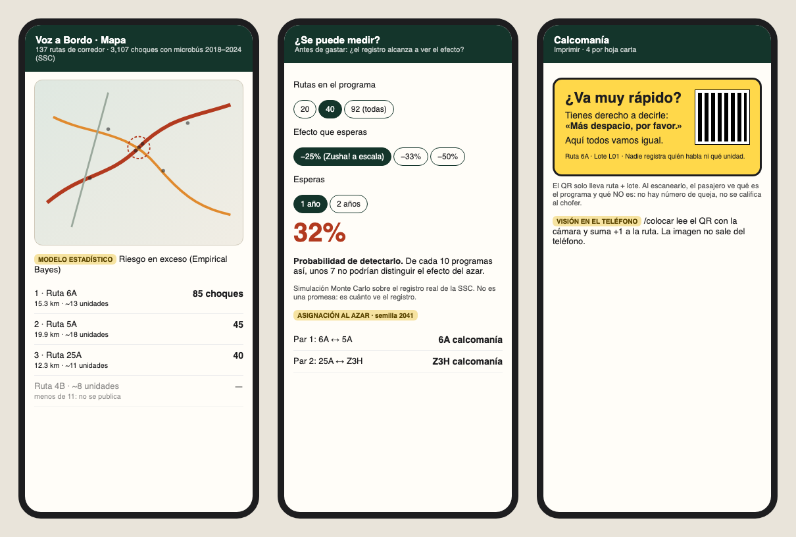
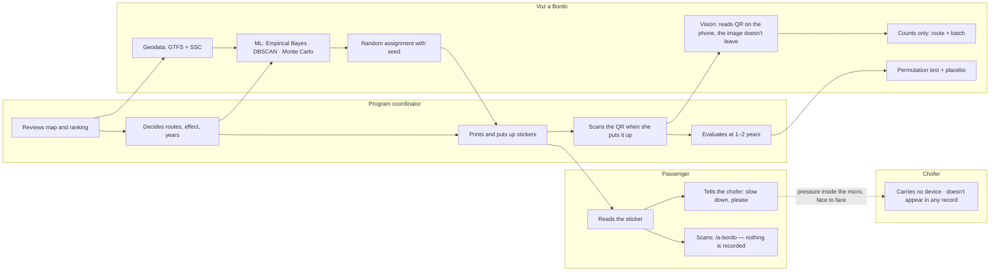

# Packet — w07-vozabordo · "Voz a Bordo: el pasajero también maneja"

> Written BEFORE the code (course discipline). Week 7 · Chapter 6 "The Holy Driver" · T7 · ADVERSARY lens · Andrés Álvarez Morphy Namnum.
> **T7 Blueprint: pending** (the Team Bending session hasn't happened as I write this). The course allows building "the fused idea or their own surviving idea"; this slice is the one that survived in my brief (COLECTIVO vacuum, through the passenger, section 4). When the Blueprint exists, the "Conditions → build" table gets updated against its conditions.

## The problem, in my words

In CDMX, 74% of public-transport trips run on micros and combis (EOD 2017). The chofer doesn't earn a salary: he owes the concesionario a daily "cuenta," and every extra passenger is his money. That's the **guerra del centavo**: speeding, cutting into lanes, braking hard at every corner. The crashes I found in the news say *exceso de velocidad*.

Everyone's solution is to watch the chofer: GPS, a C5 camera, a panic button, telemetry. My fight killed that route: a device the chofer owns gets switched off exactly on the day that kills, and once it exists, "phone off" reads as a confession. The concesionario is the only one with a reason to install it, and his reason is to see the chofer's real take and raise the cuenta.

The best evidence in the world goes the other way. In Kenya, the state bolted speed governors onto matatus and it had **no measurable effect** on insurance claims (Habyarimana & Jack, NBER 2012). A **sticker** inviting passengers to tell the driver to slow down cut claims by **half to two-thirds** in the pilot and by **one-quarter to one-third at scale** (Zusha!, PNAS 2015), without recording anyone.

What nobody does in Mexico: **choose the routes with data, assign them at random against control routes, and measure on the public ledger whether crashes went down.** And before that, the Adversary question: **can CDMX's ledger even see a drop that size?**

## Exact user

- **The coordinator of a road-safety program** on concession routes (SEMOVI, an NGO, or a route organization willing to try it). Uses Excel, doesn't program, has to justify every peso to someone.
- Persona for the synthetic test: **"Lic. Mariana Robles,"** 38, analyst in the road-safety area of a CDMX civil organization. She's used to SEMOVI reports, knows what a route is but not what "power" is, works on a work laptop and a mid-range Android, and has to present to a director who asks "and how do we know it worked?" *(Invented persona, built from the week's research; not a real person.)*
- **Second actor:** the passenger who reads the sticker and scans its QR (it leads to a page that explains nothing is recorded).

## Definition of success

**Before the module closes**, at the live URL, with no account:
1. On `/mapa` she sees the **137 concession-corridor routes** (real GTFS) and the **3,107 crashes involving a microbús 2018–2024** (real SSC), the **route ranking by excess risk** (Empirical Bayes) and the **hotspot corners** (DBSCAN). Routes with fewer than 11 estimated units show up as "not published."
2. On `/plan` she picks how many routes, what effect she expects (25%, 33%, 50%) and how many years she'll wait, and the app answers **"Can it be measured?"** with the probability of detecting it (Monte Carlo simulation on the real ledger). Then it **assigns at random** which routes get the sticker and which are control, with a visible seed, and lets her download the list.
3. On `/calcomania` she prints the sticker (Spanish, social cover, no complaint number) with a QR that carries only **route + batch**.
4. On `/colocar`, with a program code, she **scans the QR with the camera** (on-device vision) once the sticker is up, and the app counts **stickers placed per route**. It never asks for a plate, unit or photo.
5. On `/evaluar` she compares before/after in sticker vs control routes on the real ledger, with a **permutation interval**. By default it runs the **PLACEBO** (fake start date, nobody put up stickers) so she can see what "no effect" looks like.
6. On `/a-bordo` the passenger reads what the program is and what it isn't.

## Mockup (generated)



*The mockup was generated by code (HTML → Playwright) before writing the app, as in weeks 4–6: the class19 team's free AI Gateway doesn't give access to image generation.*

## Flow

```mermaid
flowchart TD
  A[Home: what it is and what it never records] --> B[/mapa: 137 GTFS routes + 3,107 SSC microbús crashes/]
  B --> C[Model: crashes within 50 m of each route → Empirical Bayes by km]
  C --> D{Does the route run 11+ estimated units?}
  D -->|no| E[Not published — a ramal that small is identifiable]
  D -->|yes| F[Enters the ranking by excess risk + DBSCAN hotspot corners]
  F --> G[/plan: how many routes · expected effect · years/]
  G --> H[Monte Carlo simulation on the ledger: probability of detecting it]
  H --> I{Can it be measured?}
  I -->|no| J[Honest verdict: more routes, more years, or don't spend]
  I -->|yes| K[Random assignment with a visible seed: sticker vs control, in pairs by rank]
  K --> L[/calcomania: print — QR = route + batch, nothing more/]
  L --> M[/colocar: program code → camera reads the QR on the phone → +1 on that route/]
  M --> N[/evaluar: before/after sticker vs control on the ledger]
  N --> O[Permutation interval: is the difference bigger than chance?]
  O --> P[By default: PLACEBO — what 'no effect' looks like]
```



## Benchmark

**The best existing solution in the world for this is** Zusha! (Kenya, Georgetown/gui2de with NTSA and insurers): stickers inside the matatu that invite passengers to speak up, evaluated with random assignment on insurance claims (−25 to −33% at scale, US$10–45 per DALY). **Mine differs/localizes in that** Mexico has no insurer ledger (70%+ of vehicles uninsured, per AMIS via Rastreator ❓), so it measures on the SSC's open ledger, chooses routes with Empirical Bayes on the real GTFS, doesn't publish routes with fewer than 11 units, and says **before** you start whether that ledger can even see the effect.

## Long view (3 sentences)

If this slice works, in three years Voz a Bordo is the protocol by which CDMX (and the metro area, once Edomex has a crash ledger) tests passenger-side safety interventions route by route, with random assignment and a public placebo. The assignments and results would be open data, so the program can't choose "its" routes after the fact or cherry-pick the good ones. The load-bearing walls: the chofer never carries a device, no record identifies a unit or a person, and nothing gets published below 11 units.

## Scope cut (what I'm NOT building this week)

- **No telemetry of any kind** on the vehicle or the chofer (that was my brief's decision, not a lack of time).
- **No complaint channel**, rating or passenger report. The QR only explains.
- **No Edomex:** there's no public crash ledger with microbús type and coordinates (400k vehicles, 7 in 10 irregular). The screen says so.
- **Only the 137 concession-corridor routes** in the open GTFS. **56% of microbús crashes (1,733 of 3,107) fall outside them**; the screen says so.
- **Estimated units:** from GTFS (cycle time / headway), not a count. One route (Z1) has implausible data and is marked "no data."
- **No LLM.** The "ML" is statistical (Empirical Bayes, DBSCAN, Monte Carlo) and runs offline in Python on the real data; the permutation test in `/evaluar` runs in the browser.
- **No real sticker in a real micro.** Any counts in `/colocar` are demo counts, labeled.

## Conditions → how the build honors them

*T7 Blueprint pending. Meanwhile, these are the conditions from my brief (sections 4 and 5).*

| Condition (brief) | How |
|---|---|
| 1. No device on the chofer | The app has no chofer mode. The only camera is the coordinator's, and it reads a QR on the phone; no frame gets saved or uploaded. |
| 2. No record per unit or per person | The QR carries `route + batch`. The server stores `{route, batch, date}` and nothing else: no plate, no unit, no photo, no name. |
| 3. Only at route level, 11 units or more | `units = ceil(round-trip time / headway)` from GTFS; <11 → not published in the ranking, the plan or the evaluation. |
| 4. Measure on a ledger that already exists | SSC traffic incidents (open data), filtered to vehicles of type MICROBUS. |
| 5. CDMX first | Edomex out, and the screen says why. |
| 6. The passenger speaks up face to face, under social cover | The sticker says "you have the right to tell him"; the QR leads to `/a-bordo`, which explains that nothing gets recorded and has no complaint button. |
| 7. Never say "it worked" without a control and a placebo | `/evaluar` always shows control + permutation interval, and opens on the PLACEBO. |

## Dragon stack (multiplies, doesn't add)

**Geodata** (GTFS + crash coordinates) × **ML** (Empirical Bayes + DBSCAN + Monte Carlo) × **vision** (on-device QR reading). The geodata builds the ledger per route; the model decides which routes are worth it and whether the effect can be seen; the vision closes the loop, because without knowing which routes really got stickers the evaluation is worthless. Take any one of the three away and the other two can't answer "did it work?".

## Architecture and stack

| Layer | Choice | Why |
|---|---|---|
| Framework | Next.js 15 (App Router, JS) + Tailwind 4 | course template |
| Data | `scripts/build_data.py` (pandas, shapely, pyproj, scikit-learn) → `public/data/rutas.json`, `choques.json`, `meta.json` | computed once from open data; reproducible |
| Map | Leaflet + OpenStreetMap tiles | free, no key |
| ML | Offline: Empirical Bayes (HSM-style, exposure = km, overdispersion by moments), DBSCAN (120 m, 8 crashes), Monte Carlo (500 simulations × 200 permutations). In the browser: permutation test for `/evaluar` | honest and labeled |
| Assignment | pseudo-random generator with a seed (mulberry32), pairs by rank, coin flip per pair | reproducible; anyone can recompute it |
| Vision | `jsQR` over the camera frames (`getUserMedia`), 100% on the phone | no image goes up |
| Sticker | `qrcode` (npm) + print CSS | |
| Persistence | Vercel Blob: one immutable JSON per placement `{route, batch, date}` | no personal data → no auth; write protected by a program code in an env var |
| Hosting | Vercel (team `class19`) | |

## Security floor

1. **Secrets:** `BLOB_READ_WRITE_TOKEN` and `PROGRAM_CODE` only in Vercel env vars; `.env*` in `.gitignore`. 2. **Auth:** doesn't apply; nothing personal gets stored (route + batch + date), and the screen says so. Writes require the program code. 3. **RLS:** doesn't apply (no Supabase). 4. **Validation:** the route must exist in the list; batch `^[A-Z0-9-]{1,12}$`; code with a fixed length and constant-time comparison; plan parameters from closed lists. 5. **Data:** the crash data are real public records **with no personal data** (SSC publishes location and counts, not names); the placement counts are demo data, labeled.

## Test plan

**Mechanical** (`node --test` over `lib/` + Playwright against production at 390 px and 1280 px):
- a) `asignar(routes, seed)` is deterministic: same seed → same list; each pair has one sticker and one control; no ineligible route shows up.
- b) `potencia(N, effect, years)` returns the value from the precomputed table (closest N, never extrapolated); N > 92 → "there aren't that many eligible routes."
- c) `evaluar()` with the placebo (seed 2041, start 2023-07-01) gives a ratio of 1.24 inside the interval → "we can't tell it apart from chance."
- d) The QR `VAB|6A|L01` decodes to route 6A, batch L01; a QR with a nonexistent route or a bad batch gets rejected; a wrong code → 401 and nothing is stored.
- e) The stored JSON has exactly the keys `{route, batch, date}`.
- f) `/mapa` at 390 px: the map and the ranking fit without horizontal scroll.

**Persona:** Lic. Mariana Robles walks through home → map → plan → sticker → evaluate from screenshots; every confusion gets logged and the worst one gets fixed before the deadline.
